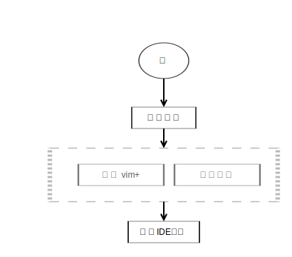

## 工程效率k快捷键配置

### 背景
- 欲先攻其事必先利器

### 如何配快捷键

#### 原则
1. 不要为快捷键而配置快捷键，工具是为了更好的提高产能
2. 与自身习惯适配

#### 快捷键来源
1. 自身编程需求，在编程中经常需要哪些操作，需要鼠标点点点的，化为快捷键形成肌肉记忆
2. 吸收其他人的经验：有时候并不能察觉出自身的缺陷和编程的丑陋，需要从他人身上学习
3. 知名的工具, 尤其是鼻祖 vim, emacs，有很多功能是想不到的，需要从优秀的编辑器上学习
4. IDE的支持, idea + vscode + sublime 等, ide有的时候有些功能非常独特，好可以学习吸收

#### 关系图

#### 基本需求快捷键详解
- ps: 快捷键是不断丰富变化的过程，根据ide的支持插件的变化而变化，本篇只会介绍基本需求快捷键.aa